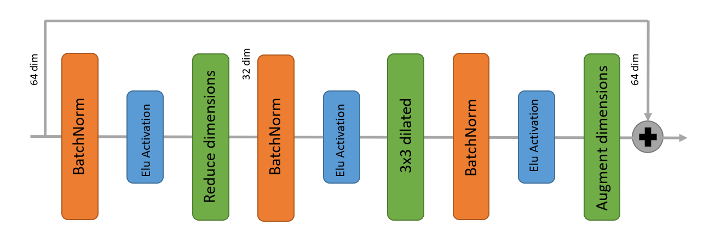
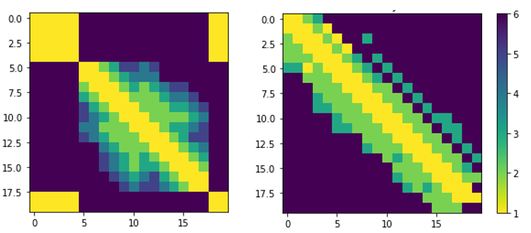
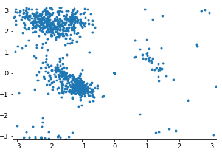
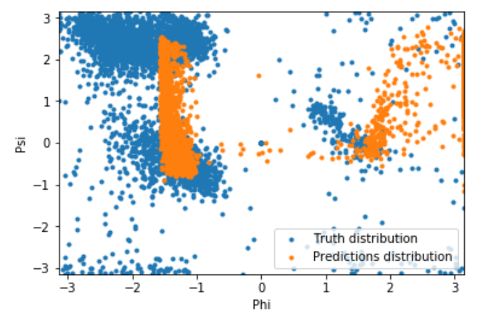

# Implementation Details

## Proposed Architecture 

The methods implemented are inspired by DeepMind's original post. Two different residual neural networks (ResNets) are used to predict **angles** between adjacent aminoacids (AAs) and **distance** between every pair of AAs of a protein. For distance prediction a 2D Resnet was used while for angles prediction a 1D Resnet was used.

	

Image from DeepMind's original blogpost.

### Distance prediction

The ResNet for distance prediction is built as a 2D-ResNet and takes as input tensors of shape LxLxN (a normal image would be LxLx3). The window length is set to 200 (we only train and predict proteins of less than 200 AAs) and smaller proteins are padded to match the window size. No larger proteins nor crops of larger proteins are used.

The 41 channels of the input are distributed as follows: 20 for AAs in one-hot encoding (LxLx20), 1 for the Van der Waals radius of the AA encoded previously and 20 channels for the Position Specific Scoring Matrix).

The network is comprised of packs of residual blocks with the architecture below illustrated with blocks cycling through 1,2,4 and 8 strides plus a first normal convolutional layer and the last convolutional layer where a Softmax activation function is applied to get an output of LxLx7 (6 classes for different distance + 1 trash class for the padding that is less penalized).

	

Architecture of the residual block used. A mini version of the block in [this description](http://predictioncenter.org/casp13/doc/presentations/Pred_CASP13-DeepLearning-AlphaFold-Senior.pdf)

The network has been trained with 134 proteins and evaluated with 16 more. Clearly unsufficient data, but memory constraints didn't allow for more. Comparably, AlphaFold was trained with 29k proteins.

The output of the network is, then, a classification among 6 classes wich are ranges of distances between a pair of AAs. Here there's an example of AlphaFold predicted distances and the distances predicted by our model:

	

Ground truth (left) and predicted distances (right) by AlphaFold.

	

Ground truth (left) and predicted distances (right) by our model (the yellow squares are a lack of exact position of the AAs described in the ProteinNet dataset documentation).

The architecture of the Residual Network for distance prediction is very simmilar, the main difference being that the model here described was trained with windows of 200x200 AAs while AlphaFold was trained with crops of 64x64 AAs. When it comes to prediction, AlphaFold used the smaller window size to average across different outputs and achieve a smoother result. Our prediction, however, is a unique window, so there's no average (noisier predictions).

### Distance prediction

The ResNet for angles prediction is built as a 1D-ResNet and takes as input tensors of shape LxN. The window length is set to 34 and we only train and predict aangles of proteins with less than 200 (L) AAs. No larger proteins nor crops of larger proteins are used.

The 41 (N) channels of the input are distributed as follows: 20 for AAs in one-hot encoding (Lx20), 1 for the Van der Waals radius of the AA encoded previously and 20 channels for the Position Specific Scoring Matrix).

We followed the ResNet20 architecture but replaced the 2D Convolutions by 1D convolutions. The network output consists of a vector of 4 numbers that represent the `sin` and `cos` of the 2 dihedral angles between two AAs (Phi and Psi).

Dihedral angles were extracted from raw coordinates of the protein backbone atoms (N-terminus, C-alpha and C-terminus of each AA). The plot of Phi and Psi recieves the name of Ramachandran plot: 

	

The cluster observed in the upper-left region corresponds to the angles comprised between AAs when they form a Beta-sheet while the cluster observed in the central-left region corresponds to the angles comprised between AAs when they form an Alpha-helix.

The results of the model when making predictions can be observed below:

	

The network has been trained with crops 38,7k crops from 600 different proteins and evaluated with some 4,3k more.

The architecture of the Residual Network is different from the one implemented in AlphaFold. The model here implemented was inspired by [this paper](https://journals.plos.org/ploscompbiol/article?id=10.1371/journal.pcbi.1005324) and [this one](https://journals.plos.org/plosone/article?id=10.1371/journal.pone.0205819).

## Results
While the architectures implemented in this first preliminary version of the project are inspired by papers with great results, the results here obtained are not as good as they could be. It's probable that the lack of Multiple Alignmnent (MSA), MSA-based features, Physicochemichal properties of AAs (beyond Van der Waals radius) or the lack of both model and feature engineering have affected the models negatively, as well as the little data that they have been trained on. 

For that reason, we can conclude that it has been a somehow naive approach and we expect to further implement some ideas/improvements to these models. 

[//]: It would be interesting to use the predictions made by the models as constraints to a folding algorithm in order to visualize our results.

## References
* [DeepMind original blog post](https://deepmind.com/blog/alphafold/)
* [AlphaFold @ CASP13: “What just happened?”](https://moalquraishi.wordpress.com/2018/12/09/alphafold-casp13-what-just-happened/#s2.2)
* [Accurate De Novo Prediction of Protein Contact Map by Ultra-Deep Learning Model](https://journals.plos.org/ploscompbiol/article?id=10.1371/journal.pcbi.1005324)
* [AlphaFold slides](http://predictioncenter.org/casp13/doc/presentations/Pred_CASP13-DeepLearning-AlphaFold-Senior.pdf)
* [De novo protein structure prediction using ultra-fast molecular dynamics simulation](https://journals.plos.org/plosone/article?id=10.1371/journal.pone.0205819)
