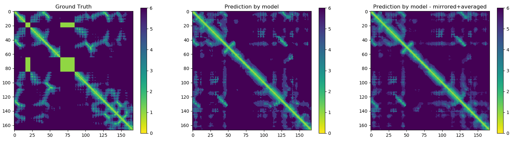
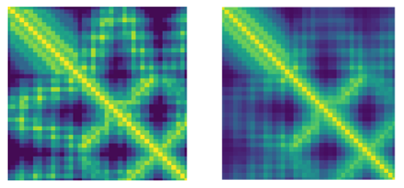

# MiniFold

## Abstract

**Introduction**: The Protein Folding Problem (predicting a protein structure from its sequence) is an interesting one since DNA sequence data available is becoming cheaper and cheaper at an unprecedented rate, even faster than Moore's law [1](https://www.genome.gov/27541954/dna-sequencing-costs-data/). Recent research has applied Deep Learning techniques in order to accurately predict the structure of polypeptides [[2](https://journals.plos.org/ploscompbiol/article?id=10.1371/journal.pcbi.1005324), [3](http://predictioncenter.org/casp13/doc/presentations/Pred_CASP13-DeepLearning-AlphaFold-Senior.pdf)]. 
**Methods**: In this work, we present an attempt to replicate the AlphaFold system for protein prediction architecture [[3]((http://predictioncenter.org/casp13/doc/presentations/Pred_CASP13-DeepLearning-AlphaFold-Senior.pdf))]. We use 1-D Residual Networks (ResNets) to predict dihedral torsion angles and 2-D ResNets to predict distance maps between the protein amino-acids[[4](https://arxiv.org/abs/1512.03385)]. We use the CASP7 ProteinNet dataset section for training and evaluation of the model [[5](https://arxiv.org/abs/1902.00249)]. An open-source implementation of the system described can be found [here](https://github.com/EricAlcaide/MiniFold).
**Results**:
**Conclusion**:

## Introduction

TL;DR: [DeepMind](https://deepmind.com) a company affiliated with Google and specialized in AI presented a novel algorithm for Protein Structure Prediction at [CASP13](http://predictioncenter.org/casp13/index.cgi) (a competition which goal is to find the best algorithms that predict protein structures in different categories).

The Protein Folding Problem is an interesting one since there's tons of DNA sequence data available and it's becoming cheaper and cheaper at an unprecedented rate (faster than [Moore's law](https://www.genome.gov/27541954/dna-sequencing-costs-data/)). The cells build the proteins they need through **transcription** (from DNA to RNA) and **translation** (from RNA to Aminocids (AAs)). However, the function of a protein does not depend solely on the sequence of AAs that form it, but also their spatial 3D folding. Thus, it's hard to predict the function of a protein from its DNA sequence. **AI** can help solve this problem by learning the relations that exist between a determined sequence and its spatial 3D folding. 

The DeepMind work presented @ CASP was not a technological breakthrough (they did not invent any new type of AI) but an **engineering** one: they applied well-known AI algorithms to a problem along with lots of data and computing power and found a great solution through model design, feature engineering, model ensembling and so on. DeepMind has no plan to open source the code of their model nor set up a prediction server.

Based on the premise exposed before, the aim of this project is to build a model suitable for protein 3D structure prediction inspired by AlphaFold and many other AI solutions that may appear and achieve SOTA results.

## Methods
### Proposed Architecture 

The [methods implemented](implementation_details.md) are inspired by DeepMind's original post. Two different residual neural networks (ResNets) are used to predict **angles** between adjacent aminoacids (AAs) and **distance** between every pair of AAs of a protein. For distance prediction a 2D Resnet was used while for angles prediction a 1D Resnet was used.

	

Image from DeepMind's original blogpost.

[Implementation_details](implementation_details.md) can be found [here together with a detailed explanation](implementation_details.md). A sample result of our distance predictor:

	

Ground truth (left) and predicted distances (right) by MiniFold.

And sample result of AlphaFold's distance predictor:

	

Ground truth (left) and predicted distances (right) by AlphaFold.

### Reproducing the results

Here are the following steps in order to run the code locally or in the cloud:
1. Clone the repo: `git clone https://github.com/EricAlcaide/MiniFold`
2. Install dependencies: `pip install -r requirements.txt`
3. Get & format the data
	1. Download data [here](https://github.com/aqlaboratory/proteinnet) (select CASP7 text-based format)
	2. Extract/Decompress the data in any directory
	3. Create the `/data` folder inside the `MiniFold` directory and copy the `training_30, training_70 and training90` files to it. Change extensions to `.txt`.
4. Execute data preprocessing notebooks (`preprocessing` folder) in the following order (we plan to release simple scripts instead of notebooks very soon):
	1. `get_proteins_under_200aa.jl *source_path* *destin_path*`:  - selects proteins under 200 residues from the *source_path* file (alternatively can be declared in the script itself) - (you will need the [Julia programming language](https://julialang.org/) v1.0 in order to run it)
		1. **Alternatively**: `julia_get_proteins_under_200aa.ipynb` (you will need Julia as well as [iJulia](https://github.com/JuliaLang/IJulia.jl))
	3. `get_angles_from_coords_py.ipynb` - calculates dihedral angles from raw coordinates
	4. `angle_data_preparation_py.ipynb`
5. Run the models!
	1. For **angles prediction**: `models/predicting_angles.ipynb`
	2. For **distance prediction**:
		1. `models/distance_pipeline/pretrain_model_pssm_l_x_l.ipynb`
		2. `models/distance_pipeline/pipeline_caller.py`

If you encounter any errors during installation, don't hesitate and open an [issue](https://github.com/EricAlcaide/MiniFold/issues).

## Discussion
### Future

There is plenty of ideas that could not be tried in this project due to computational and time constraints. In a brief way, some promising ideas or future directions are listed below:

* Train with crops of 64x64 AAs, not windows of 200x200 AAs and average at prediction time.
* Use data from Multiple Sequence Alignments (MSA) such as paired changes bewteen AAs.
* Use distance map as potential input for angle prediction or vice versa.
* Train with more data
* Use predictions as constraints to a Protein Structure Prediction pipeline (CNS, Rosetta Solve or others).
* Set up a prediction script/pipeline from raw text/FASTA file 

### Limitations

This project has been developed mainly during 3 weeks by 1 person and, therefore, many limitations have appeared.
They will be listed below in order to give a sense about what this project is and what it's not.

* **No usage of Multiple Sequence Alignments (MSA)**: The methods developed in this project don't use [MSA](https://www.ncbi.nlm.nih.gov/pubmed/27896722) nor MSA-based features as input. 
* **Computing power/memory**: Development of the project has taken part in a computer with the following specifications: Intel i7-6700k, 8gb RAM, NVIDIA GTX-1060Ti 6gb and 256gb of storage. The capacity for data exploration, processing, training and evaluating the models is limited.
* **GPU/TPUs for training**: The models were trained and evaluated on a single GPU. No cloud servers were used. 
* **Time**: Three weeks of development during spare time.
* **Domain expertise**: No experts in the field of genomics, proteomics or bioinformatics. The author knows the basics of Biochemistry and Deep Learning.
* **Data**: The average paper about Protein Structure Prediction uses a personalized dataset acquired from the Protein Data Bank [(PDB)](https://www.ncbi.nlm.nih.gov/pubmed/28573592). No such dataset was used. Instead, we used a subset of the [ProteinNet](https://github.com/aqlaboratory/proteinnet) dataset from CASP7. Our models are trained with just 150 proteins (distance prediction) and 600 proteins (angles prediction) due to memory constraints. 

Due to these limitations and/or constraints, the precission/accuracy the methods here developed can achieve is limited when compared against State Of The Art algorithms.

## References
* [DeepMind original blog post](https://deepmind.com/blog/alphafold/)
* [AlphaFold @ CASP13: “What just happened?”](https://moalquraishi.wordpress.com/2018/12/09/alphafold-casp13-what-just-happened/#s2.2)
* [Siraj Raval's YT video on AlphaFold](https://www.youtube.com/watch?v=cw6_OP5An8s)
* [ProteinNet dataset](https://github.com/aqlaboratory/proteinnet)

## Contribute
Hey there! New ideas are welcome: open/close issues, fork the repo and share your code with a Pull Request.
Clone this project to your computer:
 
`git clone https://github.com/EricAlcaide/MiniFold`
 
By participating in this project, you agree to abide by the thoughtbot [code of conduct](https://thoughtbot.com/open-source-code-of-conduct)
 
## Meta
 
* **Author's GitHub Profile**: [Eric Alcaide](https://github.com/EricAlcaide/)
* **Twitter**: [@eric_alcaide](https://twitter.com/eric_alcaide)
* **Email**: ericalcaide1@gmail.com